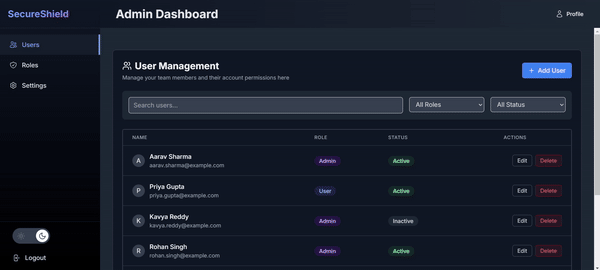

# 🛡️ SecureShield:  Role-Based Access Control Interface

<div align="center">
  
</div>

<span></span>
<p align="center">
  <a href="https://shield-102ac.web.app/" target="_blank">Visit the Website</a>
</p>


## 📝 Project Overview

SecureShield is a cutting-edge, user-friendly Role-Based Access Control (RBAC) interface designed to provide comprehensive user management and granular permission allocation applications. The solution combines robust security with an intuitive design to streamline administrative workflows.

## 🏗️ Project Structure

```
secureshield/
├── public/
│   └── index.html
├── src/
│   ├── components/
│   │   ├── layout/
│   │   │   ├── Sidebar.jsx
│   │   │   ├── Header.jsx
│   │   │   └── Layout.jsx
│   │   ├── users/
│   │   │   ├── UserList.jsx
│   │   │   ├── UserModal.jsx
│   │   │   └── UserFilter.jsx
│   │   ├── roles/
│   │   │   ├── RoleList.jsx
│   │   │   ├── RoleModal.jsx
│   │   │   └── PermissionMatrix.jsx
│   │   └── common/
│   │       ├── Table.jsx
│   │       ├── Modal.jsx
│   │       └── Button.jsx
│   ├── context/
│   │   └── AuthContext.jsx
│   ├── hooks/
│   │   ├── useUsers.js
│   │   └── useRoles.js
│   ├── services/
│   │   └── mockData.js
│   ├── utils/
│   │   ├── constants.js
│   │   └── helpers.js
│   ├── App.jsx
│   └── index.jsx
└── package.json
```

## ✨ Key Features

### 🔐 Advanced Access Control
- **Granular Role Management**: Create and configure roles with precise permission levels
- **Comprehensive Permission Tracking**: Monitor and audit access rights in real-time
- **Flexible Access Configuration**: Easily modify permissions across different user groups

### 👥 User Management Excellence
- **Intuitive User Interface**: Streamlined user creation and management
- **Dynamic Role Assignment**: Quickly assign or modify user roles
- **Detailed Activity Logging**: Track user actions and access attempts
- **Bulk User Management**: Efficiently handle multiple user accounts simultaneously

### 🛡️ Security-First Design
- **Adaptive Security Policies**: Intelligent access control that evolves with your organization
- **Comprehensive Permission Matrix**: Visual representation of role-based access
- **Principle of Least Privilege**: Ensure users have minimal necessary access

## 🚀 Technology Stack

| Technology | Purpose |
|-----------|---------|
| React 18 | Modern UI Framework |
| Context API | State Management |
| Tailwind CSS | Responsive Design |
| lucide-react & heroicons | Component Library |


## 🛠️ Prerequisites

Before you begin, ensure you have the following:
- Node.js (v18+)
- npm (Node Package Manager)
- Modern web browser
- Visual Studio Code (recommended)

## 🚀 Quick Start Guide

### 1. Clone the Repository
```bash
git clone https://github.com/sandeshkhairnar/SecureShield.git
cd secureshield
```

### 2. Install Dependencies
```bash
npm install
```

### 3. Launch Development Server
```bash
npm run dev
```

### 4. Access the Application
Open your browser and navigate to `http://localhost:3000`

## 🔧 Configuration & Customization

SecureShield offers extensive customization options:

- **Global Configuration**: `src/utils/constants.ts`
  - Modify default settings, theme variables, and global constants

- **Design Customization**: `tailwind.config.js`
  - Adjust color schemes, spacing, and design system parameters

## 🔒 Security Principles

Our approach to security is comprehensive and multi-layered:

- **Principle of Least Privilege**: Users receive minimal access required for their roles
- **Zero-Trust Architecture**: Continuous verification of user actions
- **Comprehensive Input Validation**: Protect against potential security vulnerabilities
- **Role-Based Access Restrictions**: Granular control over system access
- 

## 📞 Support & Contact

- 📧 Email: sandeshkhairnar123@gmail.com
- 🐱 GitHub: [github.com/sandeshkhairnar/](https://github.com/sandeshkhairnar/)

---


*Secure, Flexible, Intuitive Access Control*
